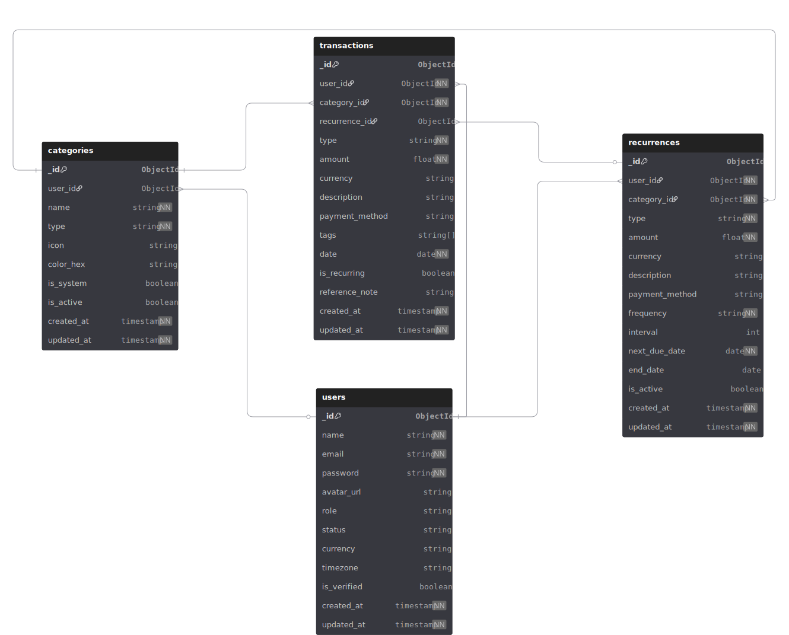

# Personal Expense Tracker — Backend

> Production-ready REST API built with **Express · TypeScript · MongoDB · Mongoose · Passport.js · node-cron**

[](https://www.typescriptlang.org/)
[](https://nodejs.org/)
[](https://www.mongodb.com/)
[](LICENSE)

---

## Table of Contents

1. [Project Overview](#1-project-overview)
2. [Architecture Overview](#2-architecture-overview)
3. [Tech Stack](#3-tech-stack)
4. [Features](#4-features)
5. [Folder Structure](#5-folder-structure)
6. [Module Scaffold Script](#6-module-scaffold-script)
7. [Database Design — ERD](#7-database-design--erd)
8. [Prerequisites](#8-prerequisites)
9. [Installation & Setup](#9-installation--setup)
10. [Environment Variables](#10-environment-variables)
11. [Running the Project](#11-running-the-project)
12. [Authentication — Passport.js](#12-authentication--passportjs)
13. [API Modules & Endpoints](#13-api-modules--endpoints)
14. [Cron Job — Recurring Transactions](#14-cron-job--recurring-transactions)
15. [Category System](#15-category-system)
16. [Postman Collection](#16-postman-collection)
17. [Build & Deployment](#17-build--deployment)
18. [Scripts Reference](#18-scripts-reference)

---

## 1. Project Overview

A secure, multi-user **personal finance tracking system** that allows users to:

- Log income and expense transactions
- Organise transactions with a two-tier category system (system-seeded + custom)
- Automate recurring payments and income entries via a scheduled cron job
- Authenticate with email/password **or** Google OAuth 2.0 via Passport.js
- Export filtered transaction data

The API follows a **clean modular architecture** where every domain (user, category, transaction, recurrence) is fully self-contained with its own constants, interfaces, model, validation, service, controller, and route.

---

## 2. Architecture Overview

```
HTTP Request
    │
    ▼
Express Router
    │
    ├── checkAuth middleware   (JWT verification, req.user stamp)
    ├── validateRequest        (Zod schema validation)
    │
    ▼
Controller  (parse req → call service → format res)
    │
    ▼
Service     (pure business logic, no Express types)
    │
    ▼
Mongoose Model  (schema, indexes, hooks, statics, instance methods)
    │
    ▼
MongoDB Atlas / Local
```

**Separation of concerns:**

| Layer           | Responsibility                                            |
| --------------- | --------------------------------------------------------- |
| `constants.ts`  | All enums and magic values — single source of truth       |
| `interface.ts`  | TypeScript contracts — services depend only on these      |
| `model.ts`      | Mongoose schema, indexes, hooks, statics                  |
| `validation.ts` | Zod schemas — validate at the HTTP boundary               |
| `service.ts`    | Business logic — no HTTP types, fully unit-testable       |
| `controller.ts` | Thin adapter — parse request, call service, send response |
| `route.ts`      | Route definitions with middleware chain                   |

---

## 3. Tech Stack

| Category        | Package                             | Version |
| --------------- | ----------------------------------- | ------- |
| Runtime         | Node.js                             | ≥ 20    |
| Package Manager | **Bun**                             | latest  |
| Language        | TypeScript                          | ^5.5    |
| Framework       | Express                             | ^4.19   |
| ODM             | Mongoose                            | ^8.0    |
| Auth            | Passport.js (local + Google OAuth2) | ^0.7    |
| Token           | jsonwebtoken                        | ^9.0    |
| Validation      | Zod                                 | ^4.4    |
| Password        | bcrypt                              | ^6.0    |
| Scheduler       | node-cron                           | ^4.2    |
| Dev server      | ts-node-dev                         | ^2.0    |
| Linting         | ESLint + Prettier                   | —       |

---

## 4. Features

### Core

| Feature                                      | Details                                                                                    |
| -------------------------------------------- | ------------------------------------------------------------------------------------------ |
| **Email/Password Auth**                      | Register, login, JWT access token, bcrypt hashing                                          |
| **Google OAuth 2.0**                         | Sign in with Google via Passport.js (`passport-google-oauth20`)                            |
| **Protected Routes**                         | `checkAuth` middleware with role-based access (user / admin)                               |
| **Transaction CRUD**                         | Create, read, update, delete with full ownership isolation                                 |
| **Recurrence CRUD**                          | Create, read, update, delete with full ownership isolation                                 |
| **Custom Category CRUD**                     | Create, read, update, delete with full ownership isolation                                 |
| **Rich Filtering**                           | Filter by type, category, date range, amount range, payment method, tags, full-text search |
| **Pagination & Sorting**                     | Page/limit/sort on all list endpoints                                                      |
| **Automation For Recurrencing Transactions** | Recurrence set to automatically creat a expense/inocome transaction by using node cron     |
| **Support Multi Currency**                   | At user level stored the timezone and currency                                             |

### Category System

| Feature               | Details                                                                                    |
| --------------------- | ------------------------------------------------------------------------------------------ |
| **System categories** | Seeded at startup — visible to all users, cannot be modified or deleted                    |
| **Custom categories** | User-created, private, soft-deletable (never hard-deleted to preserve transaction history) |
| **Type enforcement**  | Transaction type must match its category type (income ↔ income, expense ↔ expense)         |

### Automation

| Feature                    | Details                                                                                                                   |
| -------------------------- | ------------------------------------------------------------------------------------------------------------------------- |
| **Recurring transactions** | Users define rules: amount, category, frequency, interval, start/end date                                                 |
| **Cron job**               | Runs daily at **00:05** — finds all due rules, auto-creates transactions, advances `next_due_date`                        |
| **Retry safety**           | If cron fails mid-run, `next_due_date` is only advanced after successful transaction creation — natural retry on next run |
| **Manual trigger**         | `POST /api/v1/recurrences/trigger` (admin only) — run cron logic on demand without waiting for midnight                   |
| **Frequencies supported**  | `daily` · `weekly` · `monthly` · `yearly` with custom `interval` multiplier                                               |

---

## 5. Folder Structure

```
personal-expense-tracker-backend/
│
├── scripts/
│   └── generate-module.ts        # CLI scaffold: creates module boilerplate
│
├── src/
│   ├── server.ts                 # Entry point — DB connect → cron register → listen
│   ├── app.ts                    # Express app factory — middleware, routes, error handler
│   │
│   ├── config/
│   │   ├── env.ts              # Typed env variable exports
│   │   └── passport.ts           # Passport strategy registration
│   │
│   ├── jobs/
│   │   └── recurrence.cron.ts    # node-cron scheduler — calls recurrenceService
│   │
│   ├── middlewares/
│   │   ├── authenticate.ts          # JWT verification + req.user stamp
│   │   ├── validateRequest.ts    # Zod schema runner
│   │   └── globalErrorHandler.ts # Centralised error formatting
│   │
│   ├── errors/
│   │   └── AppError.ts           # Custom error class (statusCode + message)
│   │
│   ├── utils/
│   │   ├── catchAsync.ts         # Async wrapper — eliminates try/catch in controllers
│   │   └── sendResponse.ts       # Uniform JSON response shape
│   │
│   └── modules/
│       ├── user/
│       │   ├── user.constants.ts
│       │   ├── user.interface.ts
│       │   ├── user.model.ts
│       │   ├── user.validation.ts
│       │   ├── user.service.ts
│       │   ├── user.controller.ts
│       │   └── user.route.ts
│       │
│       ├── category/
│       │   ├── category.constants.ts
│       │   ├── category.interface.ts
│       │   ├── category.model.ts
│       │   ├── category.validation.ts
│       │   ├── category.service.ts
│       │   ├── category.controller.ts
│       │   └── category.route.ts
│       │
│       ├── transaction/
│       │   ├── transaction.constants.ts
│       │   ├── transaction.interface.ts
│       │   ├── transaction.model.ts
│       │   ├── transaction.validation.ts
│       │   ├── transaction.utils.ts
│       │   ├── transaction.service.ts
│       │   ├── transaction.controller.ts
│       │   └── transaction.route.ts
│       │
│       └── recurrence/
│           ├── recurrence.constants.ts
│           ├── recurrence.interface.ts
│           ├── recurrence.model.ts
│           ├── recurrence.validation.ts
│           ├── recurrence.service.ts
│           ├── recurrence.controller.ts
│           └── recurrence.route.ts
│
├── .env
├── .env.example
├── .eslintrc.js
├── .prettierrc
├── tsconfig.json
└── package.json
```

---

## 6. Module Scaffold Script

A custom CLI script (`scripts/generate-module.ts`) automates boilerplate creation. Running it prompts for a module name and generates the full file set instantly — keeping all modules structurally consistent from day one.

**Run the scaffold:**

```bash
bun run generateModule
```

The script uses Node's built-in `fs`, `path`, and `readline` modules plus `colors` for terminal output — no extra dependencies.

**What it generates for a new module `foo`:**

```
src/modules/foo/
  foo.constants.ts
  foo.interface.ts
  foo.model.ts
  foo.validation.ts
  foo.service.ts
  foo.controller.ts
  foo.route.ts
```

Every generated file includes the correct import paths, export patterns, and comment headers — matching the existing module style exactly.

---

## 7. Database Design — ERD

The ERD was designed with [dbdiagram.io](https://dbdiagram.io/d/Personal-Expense-Tracker-6a0079dc54a51d93d3e313f8) and covers all four collections and their relationships.

**Recommended export format: SVG**

SVG is vector-based — it renders perfectly at any zoom level in GitHub README files, documentation sites, or printed PDFs without pixelation. Export from dbdiagram.io via **Export → SVG** and place the file at:

```
docs/
└── erd.svg
```

Embed in this README:

```markdown

```

### Collections at a glance

| Collection     | Purpose                                            |
| -------------- | -------------------------------------------------- |
| `users`        | Account, auth credentials, preferences             |
| `categories`   | System-seeded + user-created classification labels |
| `transactions` | Individual income/expense records                  |
| `recurrences`  | Recurring rule definitions — drives the cron job   |

### Key relationships

```
users        1 ───< categories    (user owns custom categories)
users        1 ───< transactions  (user owns transactions)
users        1 ───< recurrences   (user owns recurrence rules)
categories   1 ───< transactions  (category classifies transactions)
categories   1 ───< recurrences   (category used in recurrence rules)
recurrences  1 ───< transactions  (cron stamps recurrence_id on generated txns)
```

> `recurrence_id` on transactions is **nullable** — only set when the transaction was auto-generated by the cron job.

---

## 8. Prerequisites

| Requirement                        | Minimum version     |
| ---------------------------------- | ------------------- |
| [Bun](https://bun.sh)              | latest              |
| [Node.js](https://nodejs.org)      | 20                  |
| [MongoDB](https://www.mongodb.com) | 6+ (local or Atlas) |
| [Git](https://git-scm.com)         | any                 |

**Install Bun** (if not already installed):

```bash
# macOS / Linux
curl -fsSL https://bun.sh/install | bash

# Windows (PowerShell)
powershell -c "irm bun.sh/install.ps1 | iex"

# Verify
bun --version
```

---

## 9. Installation & Setup

```bash
# 1. Clone the repository
git clone https://github.com/your-username/personal-expense-tracker-backend.git
cd personal-expense-tracker-backend

# 2. Install all dependencies with Bun
bun install

# 3. Copy the environment template
cp .env.example .env

# 4. Fill in your values in .env (see section 10)
```

> **Why Bun?**
> Bun installs packages significantly faster than npm or yarn, has a built-in test runner, and is a drop-in replacement for the Node.js runtime. All existing npm scripts work unchanged with `bun run`.

---

## 10. Environment Variables

Copy `.env.example` to `.env` and fill in every value before starting the server.

```env
# ── Server ────────────────────────────────────────────────
NODE_ENV=development
PORT=5000

# ── MongoDB ───────────────────────────────────────────────
DATABASE_URL=mongodb://127.0.0.1:27017/expense-tracker
# For Atlas: mongodb+srv://<user>:<password>@cluster.mongodb.net/expense-tracker

# ── JWT ───────────────────────────────────────────────────
JWT_ACCESS_SECRET=your_very_long_random_access_secret_here
JWT_ACCESS_EXPIRES_IN=15m

JWT_REFRESH_SECRET=your_very_long_random_refresh_secret_here
JWT_REFRESH_EXPIRES_IN=7d

# ── Bcrypt ────────────────────────────────────────────────
BCRYPT_SALT_ROUNDS=12

# ── Google OAuth (Passport.js) ────────────────────────────
GOOGLE_CLIENT_ID=your_google_client_id
GOOGLE_CLIENT_SECRET=your_google_client_secret
GOOGLE_CALLBACK_URL=http://localhost:5000/api/v1/auth/google/callback

# ── Client (for redirect after OAuth) ────────────────────
FRONTEND_URL=http://localhost:3000


```

**Getting Google OAuth credentials:**

1. Go to [Google Cloud Console](https://console.cloud.google.com/)
2. Create a project → **APIs & Services** → **Credentials**
3. Create **OAuth 2.0 Client ID** (Web application)
4. Add `http://localhost:5000/api/v1/auth/google/callback` to Authorized redirect URIs
5. Copy Client ID and Client Secret into `.env`

---

## 11. Running the Project

### Development (with hot reload)

```bash
bun run dev
```

Uses `ts-node-dev` with `--respawn --transpile-only` — restarts on file changes, skips full type-checking for speed.

### Type checking only (no emit)

```bash
bun run typecheck
```

### Production build

```bash
bun run build    # compiles TypeScript → dist/
bun run start    # runs dist/server.js
```

### Lint & format

```bash
bun run lint         # check for ESLint issues
bun run lint:fix     # auto-fix ESLint issues
bun run format       # Prettier format all src files
```

---

## 12. Authentication — Passport.js

This project implements two Passport.js strategies registered in `src/config/passport.ts`.

### Strategy 1 — Local (email + password)

```
POST /api/v1/auth/register    → creates user, returns JWT
POST /api/v1/auth/login       → validates credentials, returns JWT
POST /api/v1/auth/logout      → clears session / token
```

**Flow:**

```
Client sends { email, password }
  → Passport LocalStrategy
  → bcrypt.compare(password, user.password)
  → JWT signed and returned
  → Client stores token, sends as Authorization: Bearer <token> on all subsequent requests
```

### Strategy 2 — Google OAuth 2.0

```
GET /api/v1/auth/google                  → redirects to Google consent screen
GET /api/v1/auth/google/callback         → Google returns code → Passport exchanges for profile
                                         → user created/found → JWT issued → redirect to client
```

**Flow:**

```
Client clicks "Sign in with Google"
  → GET /api/v1/auth/google
  → Passport GoogleStrategy redirects to accounts.google.com
  → User consents → Google redirects to /callback with auth code
  → Passport exchanges code for profile (name, email, googleId)
  → Service finds existing user by googleId/email or creates new one
  → JWT issued → redirect to CLIENT_URL with token in query param or cookie
```

### Protecting routes

Every protected route uses the `checkAuth` middleware:

```typescript
router.get('/profile', authenticate(UserRole.USER, UserRole.ADMIN), userController.getProfile);
```

`checkAuth` verifies the Bearer JWT, attaches the decoded user to `req.user`, and rejects invalid or expired tokens with `401 Unauthorized`.

---

## 13. API Modules & Endpoints

Base URL: `http://localhost:5000/api/v1`

All protected endpoints require:

```
Authorization: Bearer <access_token>
```

---

### Auth

| Method | Endpoint                | Auth | Description                    |
| ------ | ----------------------- | ---- | ------------------------------ |
| POST   | `/auth/register`        | ✗    | Register with email + password |
| POST   | `/auth/login`           | ✗    | Login, receive JWT             |
| POST   | `/auth/logout`          | ✓    | Logout                         |
| GET    | `/auth/google`          | ✗    | Initiate Google OAuth flow     |
| GET    | `/auth/google/callback` | ✗    | Google OAuth callback          |

---

### Users

| Method | Endpoint                | Auth    | Description               |
| ------ | ----------------------- | ------- | ------------------------- |
| GET    | `/users/me`             | ✓ USER  | Get own profile           |
| PATCH  | `/users/update-profile` | ✓ USER  | Update own profile        |
| DELETE | `/users/delete-account` | ✓ USER  | Deactivate own account    |
| GET    | `/users`                | ✓ ADMIN | List all users            |
| PATCH  | `/users/:id/status`     | ✓ ADMIN | Suspend / reactivate user |

---

### Categories

| Method | Endpoint          | Auth   | Description                        |
| ------ | ----------------- | ------ | ---------------------------------- |
| GET    | `/categories`     | ✓ USER | List all categories (own + system) |
| POST   | `/categories`     | ✓ USER | Create custom category             |
| GET    | `/categories/:id` | ✓ USER | Get single category                |
| PATCH  | `/categories/:id` | ✓ USER | Update own category                |
| DELETE | `/categories/:id` | ✓ USER | Soft-delete own category           |

**Query params for `GET /categories`:**

| Param           | Type    | Example   | Description                               |
| --------------- | ------- | --------- | ----------------------------------------- |
| `type`          | string  | `expense` | Filter by `income` or `expense`           |
| `isActive`      | boolean | `true`    | Filter by active status                   |
| `includeSystem` | boolean | `true`    | Include system categories (default: true) |
| `page`          | number  | `1`       | Page number                               |
| `limit`         | number  | `50`      | Items per page (max 100)                  |

---

### Transactions

| Method | Endpoint                | Auth   | Description                             |
| ------ | ----------------------- | ------ | --------------------------------------- |
| POST   | `/transactions`         | ✓ USER | Create transaction                      |
| GET    | `/transactions`         | ✓ USER | List transactions (filtered, paginated) |
| GET    | `/transactions/summary` | ✓ USER | Income / expense / balance totals       |
| GET    | `/transactions/:id`     | ✓ USER | Get single transaction                  |
| PATCH  | `/transactions/:id`     | ✓ USER | Update transaction                      |
| DELETE | `/transactions/:id`     | ✓ USER | Delete transaction                      |

> **Important:** `GET /transactions/summary` is declared **before** `GET /transactions/:id` in the router to prevent Express from interpreting `"summary"` as a MongoDB ObjectId param.

**Query params for `GET /transactions`:**

| Param           | Type     | Example      | Description                                     |
| --------------- | -------- | ------------ | ----------------------------------------------- |
| `type`          | string   | `expense`    | `income` or `expense`                           |
| `categoryId`    | ObjectId | `64abc...`   | Filter by category                              |
| `paymentMethod` | string   | `card`       | cash · card · mobile_banking · bank_transfer    |
| `startDate`     | ISO date | `2024-01-01` | Range start                                     |
| `endDate`       | ISO date | `2024-01-31` | Range end                                       |
| `minAmount`     | number   | `100`        | Minimum amount                                  |
| `maxAmount`     | number   | `5000`       | Maximum amount                                  |
| `searchTerm`    | string   | `coffee`     | Full-text search on description + referenceNote |
| `page`          | number   | `1`          | Page number                                     |
| `limit`         | number   | `20`         | Items per page (max 100)                        |
| `sort`          | string   | `date`       | `date` · `amount` · `createdAt`                 |

**Create transaction body:**

```json
{
  "categoryId": "64abc123...",
  "type": "expense",
  "amount": 1500,
  "currency": "BDT",
  "description": "Monthly groceries",
  "paymentMethod": "mobile_banking",
  "tags": ["groceries", "monthly"],
  "date": "2024-01-15",
  "referenceNote": "Receipt #4421"
}
```

---

### Recurrences

| Method | Endpoint               | Auth    | Description               |
| ------ | ---------------------- | ------- | ------------------------- |
| POST   | `/recurrences`         | ✓ USER  | Create recurring rule     |
| GET    | `/recurrences`         | ✓ USER  | List own recurrence rules |
| GET    | `/recurrences/:id`     | ✓ USER  | Get single rule           |
| PATCH  | `/recurrences/:id`     | ✓ USER  | Update rule               |
| DELETE | `/recurrences/:id`     | ✓ USER  | Delete rule               |
| POST   | `/recurrences/trigger` | ✓ ADMIN | Manually fire cron logic  |

**Create recurrence body:**

```json
{
  "categoryId": "64abc123...",
  "type": "expense",
  "amount": 15000,
  "currency": "BDT",
  "description": "Monthly house rent",
  "paymentMethod": "bank_transfer",
  "frequency": "monthly",
  "interval": 1,
  "startDate": "2024-02-01",
  "endDate": null
}
```

**Frequency options:** `daily` · `weekly` · `monthly` · `yearly`

**Interval examples:**

| frequency | interval | Meaning       |
| --------- | -------- | ------------- |
| `monthly` | `1`      | Every month   |
| `monthly` | `3`      | Every quarter |
| `weekly`  | `2`      | Biweekly      |
| `yearly`  | `1`      | Once a year   |

---

## 14. Cron Job — Recurring Transactions

The scheduler lives in `src/jobs/recurrence.cron.ts` and is powered by `node-cron`.

### How it works

```
Every day at 00:05 (configurable timezone)
  │
  ▼
Recurrence.findDueToday()
  → finds all { isActive: true, nextDueDate: { $lte: today } }
  │
  ▼
For each due recurrence:
  1. Transaction.create({ ...recurrence fields, isRecurring: true, recurrenceId })
  2. recurrence.advanceNextDueDate()   ← only called AFTER successful create
     → advances nextDueDate by interval × frequency
     → auto-deactivates if past endDate
```

### Retry safety

If `Transaction.create()` throws for a specific recurrence, `advanceNextDueDate()` is **not called**. The cron will find and retry that recurrence the next day automatically — no manual intervention needed.

### Registering the cron

In `src/server.ts`, register **after** the MongoDB connection is confirmed:

```typescript
import { registerRecurrenceCron, stopRecurrenceCron } from './jobs/recurrence.cron';

mongoose.connect(config.databaseUrl).then(() => {
  console.log('MongoDB connected');
  registerRecurrenceCron(); // ← register here, not before DB connect
  app.listen(config.port, () => {
    console.log(`Server running on port ${config.port}`);
  });
});

// Graceful shutdown
process.on('SIGTERM', () => {
  stopRecurrenceCron();
  server.close(() => process.exit(0));
});
```

### Manual trigger (development / recovery)

```bash
POST /api/v1/recurrences/trigger
Authorization: Bearer <admin_token>
```

Use this to test recurrence logic without waiting for midnight, or to recover after a server downtime window.

---

## 15. Category System

### Two-tier design

| Tier   | `isSystem` | `userId`   | Who can see | Who can edit/delete |
| ------ | ---------- | ---------- | ----------- | ------------------- |
| System | `true`     | `null`     | All users   | Nobody (immutable)  |
| Custom | `false`    | `ObjectId` | Owner only  | Owner only          |

### System categories (seeded at startup)

**Expense:** Food · Rent · Travel · Health · Shopping · Entertainment · Education · Utilities · Other

**Income:** Salary · Business · Investment · Gift · Other

### Rules enforced at service layer

- Transaction type must match its category type — an `income` transaction cannot use an `expense` category.
- System categories cannot be modified or deleted by any user (including admins via the API).
- Custom categories are **soft-deleted** (`isActive = false`) — never hard-deleted — to preserve the integrity of historical transaction data that references them.
- Duplicate category names per user+type combination are rejected before hitting the database.

---

## 16. Postman Collection

### Import steps

1. Open **Postman** → click **Import** (top left)
2. Select the collection file: `docs/postman/Personal-Expense-Tracker.postman_collection.json`
3. Import the environment file: `docs/Personal_Expense_API.postman_collection.json`
4. Select the **Local** environment from the top-right dropdown

### Environment variables (auto-managed)

| Variable         | Set by          | Description                           |
| ---------------- | --------------- | ------------------------------------- |
| `BASE_URL`       | Manual          | `http://localhost:5000/api/v1`        |
| `ACCESS_TOKEN`   | Login script    | Auto-set from login/register response |
| `ADMIN_TOKEN`    | Manual          | Token of an admin user                |
| `USER_ID`        | Login script    | Auto-set from login response          |
| `CATEGORY_ID`    | Manual / script | Used in transaction requests          |
| `TRANSACTION_ID` | Create script   | Auto-set after creating a transaction |
| `RECURRENCE_ID`  | Create script   | Auto-set after creating a recurrence  |

### Recommended test order

```
1.  Auth / Register
2.  Auth / Login                  ← ACCESS_TOKEN auto-set
3.  Users / Get My Profile
4.  Categories / List All         ← see system categories
5.  Categories / Create Custom
6.  Transactions / Create         ← TRANSACTION_ID auto-set
7.  Transactions / List All
8.  Transactions / Get Summary
9.  Transactions / Update
10. Recurrences / Create          ← RECURRENCE_ID auto-set
11. Recurrences / List All
12. Recurrences / Trigger (admin) ← test cron manually
13. Transactions / List All       ← verify auto-generated transaction appeared
14. Auth / Google OAuth           ← open in browser, not Postman
```

### Testing Google OAuth

Google OAuth requires a browser redirect flow — it cannot be tested directly in Postman. Open this URL in your browser:

```
http://localhost:5000/api/v1/auth/google
```

After completing the Google consent screen, the callback will redirect to your `CLIENT_URL` with the JWT token appended. Copy the token and paste it into the `ACCESS_TOKEN` environment variable in Postman.

---

## 17. Build & Deployment

### Production build

```bash
bun run build    # TypeScript compile → dist/
bun run start    # node dist/server.js
```

### Environment checklist before deploy

- [ ] `NODE_ENV=production`
- [ ] `DATABASE_URL` points to production MongoDB Atlas cluster
- [ ] `JWT_ACCESS_SECRET` and `JWT_REFRESH_SECRET` are strong random strings (≥ 64 chars)
- [ ] `GOOGLE_CALLBACK_URL` updated to production domain
- [ ] `CLIENT_URL` updated to production frontend URL
- [ ] `CRON_TIMEZONE` matches your server's intended timezone

### Recommended production setup

| Concern         | Recommendation                                                          |
| --------------- | ----------------------------------------------------------------------- |
| Process manager | PM2 (`pm2 start dist/server.js --name tracker-api`)                     |
| Reverse proxy   | Nginx with SSL termination                                              |
| Database        | MongoDB Atlas M10+ with IP whitelist                                    |
| Secrets         | Environment variables injected by platform (Railway / Render / EC2 SSM) |
| Logs            | PM2 log rotation or a log aggregation service                           |

---

## 18. Scripts Reference

All scripts are run with `bun run <script>`:

| Script           | Command                                      | Description                       |
| ---------------- | -------------------------------------------- | --------------------------------- |
| `dev`            | `ts-node-dev --respawn --transpile-only ...` | Start dev server with hot reload  |
| `generateModule` | `ts-node-dev ... scripts/generate-module.ts` | Scaffold a new module             |
| `build`          | `npm run clean && tsc -p tsconfig.json`      | Compile TypeScript to `dist/`     |
| `start`          | `node dist/server.js`                        | Run compiled production build     |
| `typecheck`      | `tsc -p tsconfig.json --noEmit`              | Type-check without emitting files |
| `lint`           | `eslint --ext .ts,.js .`                     | Check for lint issues             |
| `lint:fix`       | `eslint . --ext .ts --fix`                   | Auto-fix lint issues              |
| `format`         | `prettier --write "src/**/*"`                | Format all source files           |
| `clean`          | `rimraf dist`                                | Delete compiled output            |

---

## Author

**Humayun Kabir**

---

_Built with TypeScript · Express · MongoDB · Passport.js · node-cron_
